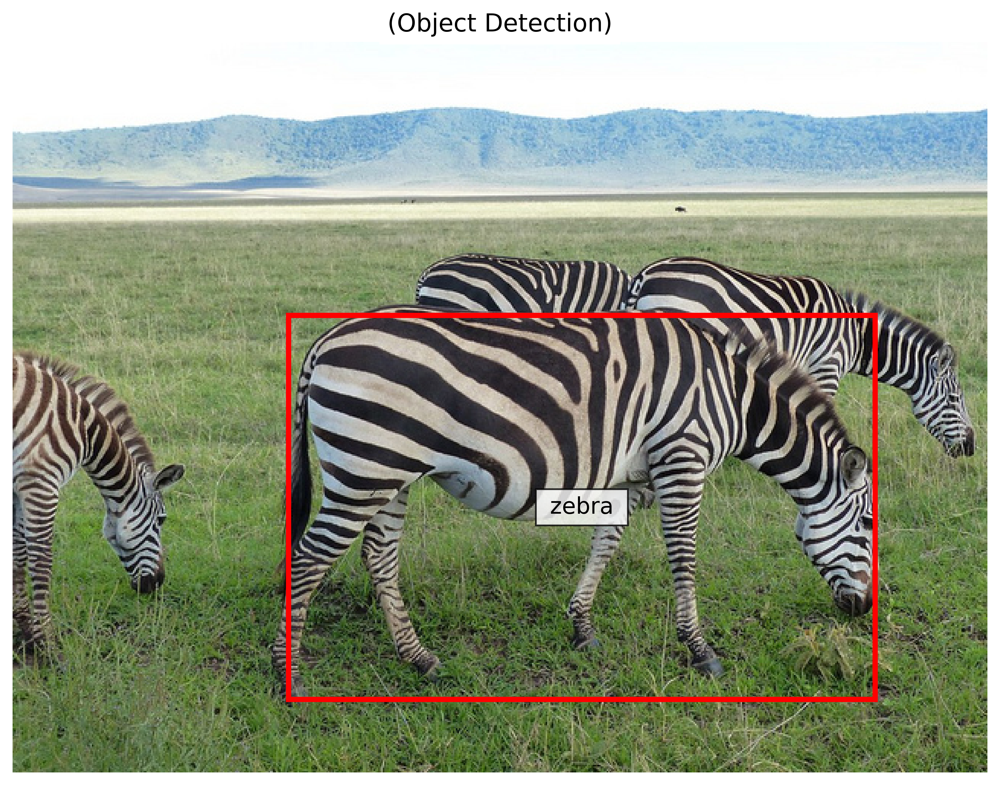

# SwinGPT_KB_CT
Implementation of SwinGPT for pixel-to-embedding (pix2emb) conversion

## Table of Contents
- [Introduction](#introduction)
- [Installation](#installation)
- [Configuration](#configuration)
- [Training](#training)
  - [Single Node, Single GPU](#single-node-single-gpu)
  - [Single Node, Multiple GPUs](#single-node-multiple-gpus)
  - [Multiple Nodes, Multiple GPUs](#multiple-nodes-multiple-gpus)
  - [Trainer Setup](#trainer-setup)
  - [Error Handling for GPU Memory](#error-handling-for-gpu-memory)
- [Checkpoints](#checkpoints)
- [Usages](#usages)
  - [Image Captioning](#image-captioning)
  - [Object Detection](#object-detection)

## Introduction
SwinGPT_KB_CT utilizes the Swin Transformer architecture integrated with GPT to perform advanced pixel-to-embedding transformations. This model is specifically designed to enhance image understanding and feature extraction capabilities in neural networks.

## Installation
Ensure your system meets the following prerequisites before installation:
- PyTorch Version: 2.3.0
- CUDA Version: 12.3.2
- Python Version: 3.10.12
- OS: Ubuntu 22.04

To install the required libraries, execute the following commands:
```bash
pip install transformers 
pip install peft 
pip install bitsandbytes
pip install lightning 
pip install torchmetrics
pip install wandb 
pip install orjson 
pip install tqdm 
pip install nltk
pip install PyYAML
pip install pycocoevalcap
```

Set the HF_HUB environment variable to enable efficient model transfer:
```bash
export HF_HUB_ENABLE_HF_TRANSFER=True
```

## Configuration
Configure your environment and Git settings:
```bash
nano ~/.bashrc
# Add the following line at the end of the file (Ctrl+x -> y -> enter)
export PYTHONPATH="${PYTHONPATH}:/data/cad-recruit-02_814/swbaek"
source ~/.bashrc

git config --global --add safe.directory /data/cad-recruit-02_814/swbaek
git config --global user.name "Sangwon Baek"
git config --global user.email "baeksw98@gmail.com"
```

## Training
This project supports various training setups ranging from single GPU to multi-node configurations.

### Single Node, Single GPU
For training on a single GPU:
```bash
torchrun --standalone --nproc_per_node=1 swingpt/train/train.py
```

### Single Node, Multiple GPUs
For training on multiple GPUs on a single node:
```bash
torchrun --standalone --nproc_per_node=4 swingpt/train/train.py
```

### Multiple Nodes, Multiple GPUs
For training on multiple GPUs across multiple nodes, additionally specify node ranks, master address, and master port:
```bash
# First Node (Master)
torchrun --nproc_per_node=4 --nnodes=2 --node_rank=0 --master_addr="(Your IP address)" --master_port="(Free port #)" swingpt/train/train.py
# Second Node
torchrun --nproc_per_node=4 --nnodes=2 --node_rank=1 --master_addr="(Your IP address)" --master_port="(Free port #)" swingpt/train/train.py
```

### Trainer Setup
In your training script, configure the PyTorch Lightning Trainer class like this to adapt to the specified number of nodes and GPUs. You may just adjust the `num_nodes` and `devices` parameters to match the number of nodes and GPUs per node:

```python
from pytorch_lightning import Trainer
from pytorch_lightning.loggers import TensorBoardLogger
from pytorch_lightning.callbacks import ModelCheckpoint

trainer = Trainer(
    logger=logger,
    max_epochs=training_args.num_train_epochs,
    num_nodes=(Node counts),  # Replace with actual number of nodes
    devices=(GPU counts per node),  # Replace with actual GPU counts per node
    accelerator='gpu' if torch.cuda.is_available() else None, 
    strategy='ddp', # Distributed Data-Parallel approach 
    callbacks=[checkpoint_callback],
    precision='16-mixed' if training_args.fp16 else '32-true', # Mixed-precision training
    accumulate_grad_batches=training_args.gradient_accumulation_steps, # Gradient accumulations
    log_every_n_steps=64, # Logging of results per counts
    val_check_interval=0.1, # Validation check per 10% intervals
)
```

### Error Handling for GPU Memory
```bash
ps aux | grep python
ps -o pid,ppid,stat,cmd -C python
kill -SIGTERM [PPID] or kill -9 [PPID]

# Use when memory doesn't get erased after running evaluate code
ps -o pid,ppid,cmd -C python | grep 'swingpt/evaluation/evaluate.py' | awk '{print $1; print $2}' | sort -u | xargs kill -9

# Use when memory doesn't get erased after running train code
ps -o pid,ppid,cmd -C python | grep 'swingpt/train/train.py' | awk '{print $1; print $2}' | sort -u | xargs kill -9
```
## Checkpoints

- **Last Checkpoint**
  - **Type:** Full finetuning
  - **Batch Size:** 16
  - **Dataloader Num Workers:** 16
  - **Gradient Accumulation:** 8
  - **Directory:** `/data/cad-recruit-02_814/swbaek/submit/final/last.ckpt`


## Usages
### 1. Image Captioning
Examples of image captioning outputs:


### 2. Object Detection
Examples of object detection outputs:



### Explanation
- **Introduction**: Briefly describes the purpose and functionality of the project.
- **Installation**: Lists system requirements and installation steps for necessary libraries.
- **Configuration**: Details how to configure the system and Git settings for project setup.
- **Training**: Divided into sub-sections for different GPU configurations, providing clear, executable commands for each scenario.
- **Usage**: This section can include basic commands to run the project or how to use the trained model.
